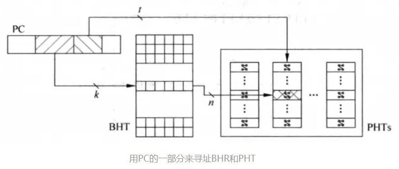
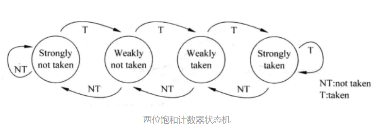
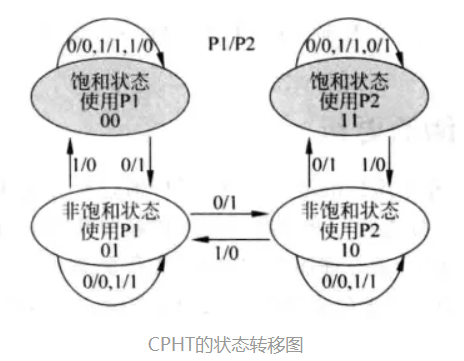
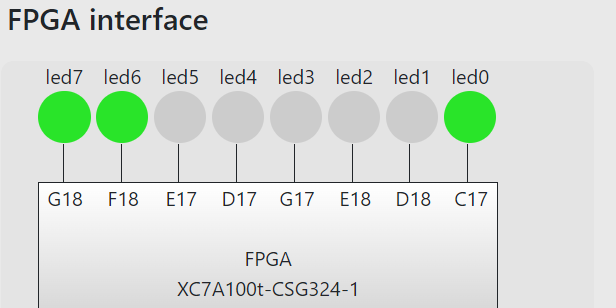
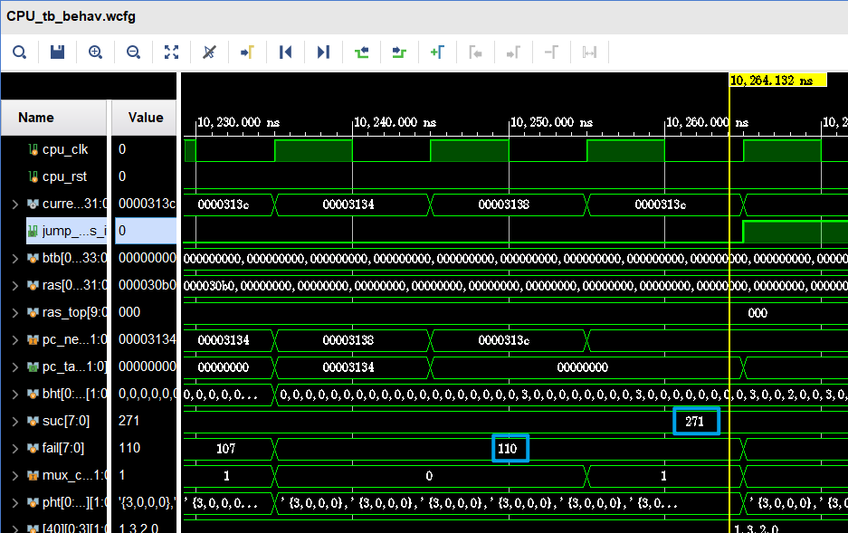
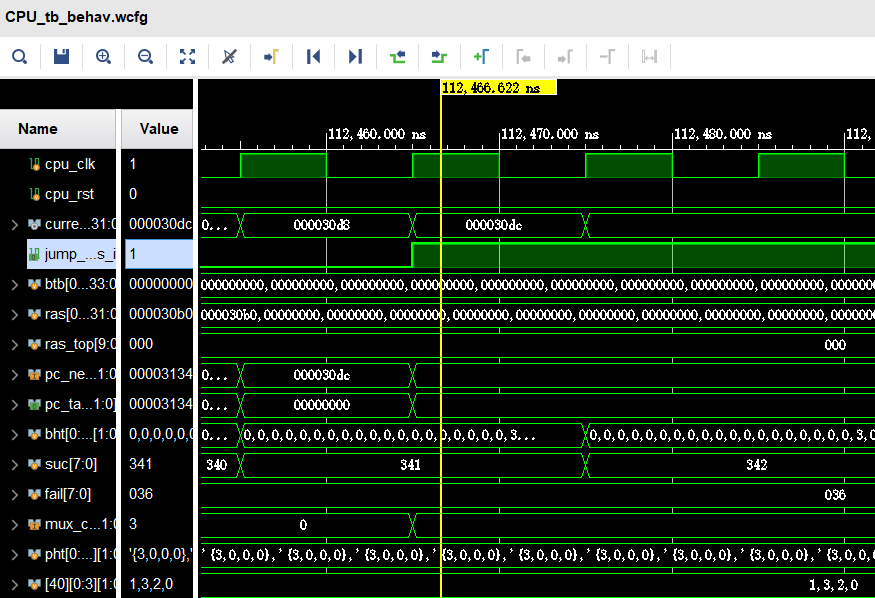

# Final report

## 实验内容

- 指令集扩展，实现所有非系统 RISC-V 32-I 指令(共 27 条) （7 分）
- 分支预测：
  - 2 bit 感知机局部历史分支预测（2 分）
  - 2 bit 感知机全局历史分支预测与竞争处理（3 分）

## 实验原理

### 指令集扩展

#### 非访存指令

> 主要修改 Control.v 模块

对于 I-type 指令，与 addi 同理，修改立即数模式 `imm_type` 和 alu 功能 `alu_func` 即可。代码如下：

```verilog
case (inst[6:0])
    7'b0010011: begin // addi, slli, srli, srai, xori, ori, andi, slti, sltiu
        rf_we = inst[11:7] ? 1'b1 : 1'b0; // 不允许写入 x0
        rf_re0 = inst[19:15] ? 1'b1 : 1'b0; // 读 x0 时 rf_re0 为 0
        rf_re1 = 1'b0;
        rf_wd_sel = 2'b00;
        mem_we = 1'b0;
        alu_src1_sel = 1'b0;
        alu_src2_sel = 1'b1;
        case (inst[14:12])
            3'b000: alu_func = 4'b0000; // addi 
            3'b001: alu_func = 4'b1001; // slli
            3'b101: alu_func = inst[30] ? 4'b1010 : 4'b1000;    // srai, srli
            3'b100: alu_func = 4'b0111; // xori
            3'b110: alu_func = 4'b0110; // ori
            3'b111: alu_func = 4'b0101; // andi
            3'b010: alu_func = 4'b0100; // slti
            3'b011: alu_func = 4'b0011; // sltiu
            default: alu_func = 4'b1111;
        endcase
        imm_type = (inst[14:12] == 3'b101) ? 3'b101 : 3'b000;
    end
endcase
```

对于 R-type 指令，与 add 同理，修改 alu 功能 `alu_func` 即可，代码如下：

```verilog
case (inst[6:0])
    7'b0110011: begin // add, and, or, sub, sll, srl, sra, xor, slt, sltu
        rf_we = inst[11:7] ? 1'b1 : 1'b0;
        rf_re0 = inst[19:15] ? 1'b1 : 1'b0;
        rf_re1 = inst[24:20] ? 1'b1 : 1'b0;
        rf_wd_sel = 2'b00;
        mem_we = 1'b0;
        alu_src1_sel = 1'b0;
        alu_src2_sel = 1'b0;
        case (inst[14:12])
            3'b000: alu_func = (inst[30] ? 4'b0001 : 4'b0000); // add, sub
            3'b110: alu_func = 4'b0110; // or
            3'b111: alu_func = 4'b0101; // and
            3'b001: alu_func = 4'b1001; // sll
            3'b101: alu_func = (inst[30] ? 4'b1010 : 4'b1000); // sra, srl
            3'b100: alu_func = 4'b0111; // xor
            3'b010: alu_func = 4'b0100; // slt
            3'b011: alu_func = 4'b0011; // sltu
            default: alu_func = 4'b1111;
        endcase
        imm_type = 3'b111;
    end
endcase
```

对于分支指令，与 beq 同理，修改分支模式 `br_type` 即可，代码如下：

```verilog
assign br_type = (inst[6:0] == 7'b1100011) ? inst[14:12] : 3'b010; // 跳转类型、不跳转
case (inst[6:0])
    7'b1100011: begin // beq, blt, bge, bne, bltu, bgeu
        rf_we = 1'b0;
        rf_re0 = inst[19:15] ? 1'b1 : 1'b0;
        rf_re1 = inst[24:20] ? 1'b1 : 1'b0;
        rf_wd_sel = 2'b00;
        mem_we = 1'b0;
        alu_src1_sel = 1'b1;
        alu_src2_sel = 1'b1;
        alu_func = 4'b0000;
        imm_type = 3'b011;
    end
endcase
```

#### 访存指令

> 主要修改 `MEM.v` 模块，增加了 `mem_ctrl.v`，`mem_in.v`，`mem_out.v` 模块

难点在 sb  等非字对齐的指令，我想到的有两种实现方式：一是在 mem 段先读再写，二是将 MEM 拆分为四段，每段写使能独立。这里我采用了第二种。优点很明显，不用先读，延迟低；缺点也很明显，初始化非常麻烦，一点也不优雅。。。

在 `MEM.v` 中，例化四个 ip 核，分别作为一个字的四个字节，接收写使能 `mem_we` (四位)。代码如下：

```verilog
mem_in mem_in0 (
    .data(dm_din),
    .we(dm_we),
    .byte0(dm_in0),
    .byte1(dm_in1),
    .byte2(dm_in2),
    .byte3(dm_in3)
);
data_mem data (
    .a(dm_addr[9:2]),        // input wire [7 : 0] a
    .d(dm_in0),        // input wire [31 : 0] d
    .dpra(mem_check_addr),  // input wire [7 : 0] dpra
    .clk(clk),    // input wire clk
    .we(dm_we[0]),      // input wire we
    .spo(dm_out0),    // output wire [31 : 0] spo
    .dpo(mem_check_data[7:0])    // output wire [31 : 0] dpo
);
data_mem1 data1 (
    .a(dm_addr[9:2]),        // input wire [7 : 0] a
    .d(dm_in1),        // input wire [31 : 0] d
    .dpra(mem_check_addr),  // input wire [7 : 0] dpra
    .clk(clk),    // input wire clk
    .we(dm_we[1]),      // input wire we
    .spo(dm_out1),    // output wire [31 : 0] spo
    .dpo(mem_check_data[15:8])    // output wire [31 : 0] dpo
);
data_mem2 data2 (
    .a(dm_addr[9:2]),        // input wire [7 : 0] a
    .d(dm_in2),        // input wire [31 : 0] d
    .dpra(mem_check_addr),  // input wire [7 : 0] dpra
    .clk(clk),    // input wire clk
    .we(dm_we[2]),      // input wire we
    .spo(dm_out2),    // output wire [31 : 0] spo
    .dpo(mem_check_data[23:16])    // output wire [31 : 0] dpo
);
data_mem3 data3 (
    .a(dm_addr[9:2]),        // input wire [7 : 0] a
    .d(dm_in3),        // input wire [31 : 0] d
    .dpra(mem_check_addr),  // input wire [7 : 0] dpra
    .clk(clk),    // input wire clk
    .we(dm_we[3]),      // input wire we
    .spo(dm_out3),    // output wire [31 : 0] spo
    .dpo(mem_check_data[31:24])    // output wire [31 : 0] dpo
);
mem_out mem_out0 (
    .byte0(dm_out0),
    .byte1(dm_out1),
    .byte2(dm_out2),
    .byte3(dm_out3),
    .re(dm_re),
    .sign(sign),
    .data(dm_dout)
);
```

可以看到，上面代码中有两个新模块，分别为 `mem_in.v`，用于将要写入内存的数据拆分为四个字节，对应内存的四段，和 `mem_out.v` ，用于将读出的四个字节组合为实际的输出。代码分别如下：

```verilog
// mem_in
case (we)
    4'b1111: begin 
        byte3 = data[31:24]; 
        byte2 = data[23:16]; 
        byte1 = data[15:8]; 
        byte0 = data[7:0]; 
    end
    4'b0011: begin 
        byte1 = data[15:8]; 
        byte0 = data[7:0]; 
    end
    4'b1100: begin 
        byte3 = data[15:8];  
        byte2 = data[7:0]; 
    end
    4'b0001: byte0 = data[7:0];
    4'b0010: byte1 = data[7:0];
    4'b0100: byte2 = data[7:0];
    4'b1000: byte3 = data[7:0];
    default: begin 
        byte3 = 8'h0; 
        byte2 = 8'h0; 
        byte1 = 8'h0; 
        byte0 = 8'h0; 
    end
endcase

// mem_out
case (re)
    4'b1111: data = {byte3, byte2, byte1, byte0};   // lw
    4'b0011: data = {{16{sign ? byte1[7] : 1'b0}}, byte1, byte0};   // lh,lhu
    4'b1100: data = {{16{sign ? byte3[7] : 1'b0}}, byte3, byte2};
    4'b0001: data = {{24{sign ? byte0[7] : 1'b0}}, byte0};  // lb,lbu
    4'b0010: data = {{24{sign ? byte1[7] : 1'b0}}, byte1};
    4'b0100: data = {{24{sign ? byte2[7] : 1'b0}}, byte2};
    4'b1000: data = {{24{sign ? byte3[7] : 1'b0}}, byte3};
    default: data = 32'h0;
endcase
```

最后就是最重要的控制信号生成模块 `mem_ctrl.v`，功能是接收指令信号和要读的地址，生成写使能 `mem_we` 和读使能 `mem_re`。另外还要生成用于位扩展的信号 `sign` ，代码如下：

```verilog
if (inst_mem[6:0] == 7'b0000011) begin
    mem_we = 4'b0000;
    case (inst_mem[14:12])
        3'b000: mem_re = 4'b0001 << dm_addr_mem[1:0];
        3'b100: mem_re = 4'b0001 << dm_addr_mem[1:0];
        3'b001: mem_re = 4'b0011 << dm_addr_mem[1:0];
        3'b101: mem_re = 4'b0011 << dm_addr_mem[1:0];
        3'b010: mem_re = 4'b1111;
        default: mem_re = 4'b0000;
    endcase
end
else if (inst_mem[6:0] == 7'b0100011) begin
    mem_re = 4'b0000;
    case (inst_mem[14:12])
        3'b000: mem_we = 4'b0001 << dm_addr_mem[1:0];
        3'b001: mem_we = 4'b0011 << dm_addr_mem[1:0];
        3'b010: mem_we = 4'b1111;
        default: mem_we = 4'b0000;
    endcase
end
else begin
    mem_re = 4'b0000;
    mem_we = 4'b0000;
end
```

> yysy，写完才想到写复杂了，但懒得改了，能跑就行（：

#### 冒险处理

在 lab5 数据通路中存在一个没有正确解决的冒险，当一条指令触发 load-use 冒险，同时需要 wb 段的前递时，由于流水线停顿，wb 段已经写入完成，无法将正确结果前递。解决方法也很简单，将 load-use 冒险的检测时间提前一个周期即可，即在 id 段检测，代码如下：

```verilog
// stall
always @(*) begin
    if ((rf_re0_id && rf_we_ex && (rf_ra0_id == rf_wa_ex) && rf_wd_sel_ex == 2'b10)
    || (rf_re1_id && rf_we_ex && (rf_ra1_id == rf_wa_ex) && rf_wd_sel_ex == 2'b10)) begin
        stall_if = 1'b1;
        stall_id = 1'b1;
    end
    else begin
        stall_if = 1'b0;
        stall_id = 1'b0;
    end
end
```


### 分支预测

#### 局部历史预测

先上图，简洁明了：



> 对应于 `BHR.v` 和 `BTB.v`，要修改 pc_mux 模块和 pc_sel_ex 模块和冒险处理模块

先看 `BHR.v` 模块，此模块作用为：根据 `pc_cur_if` 在指令刚到 if 段时直接给出预测结果 `jump_guess_if`。

用寄存器堆实现 bht 表，每个表项代表一个 pc 的历史分支情况。同样用寄存器堆实现 pht 表（二维），每个表项代表一个 pc 在某种局势下的预测状态。即，根据 pc 通过 bht 表索引到它的局部历史，再通过 pc 和局部历史索引到一个 pht 表项（预测状态），最后根据预测状态做出预测。

上面所说的预测状态就是 2bit 感知机，这里编码如下：00/不跳，01/跳，10/肯定跳，11/肯定不跳。状态转换如下图：



另外，因为要在 ex 段维护表项的更新，所以需要传入实际跳转结果 `jump_ex`。要处理流水线的停顿和冲刷的影响，所以需要传入 `stall_if`，`stall_id`，`flush_id`，`flush_ex`，当检测到 flush_ex 和 flush_id 时，表示流水线的 ex 段会停滞两周期，所以 bht 也不能更新；当检测到 stall_if 和 stall_id 时，表示流水线的 ex 段会停顿一周期，所以 bht 同样不能更新，这里我们用一个计数器 `count` 即可处理。

主要代码如下：

```verilog
// 2bit 计数器状态
parameter NT = 2'b00;   // 不跳
parameter T = 2'b01;    // 跳
parameter ST = 2'b10;   // 肯定跳
parameter SNT = 2'b11;  // 肯定不跳

// 查询 PHT
wire [8:0] index_if;
assign index_if = pc_if[10:2];
assign jump_local_if = (pht[index_if][bht[index_if]] == T || pht[index_if][bht[index_if]] == ST);

// 更新 BHT 和 PHT
// 考虑流水线停顿或冲刷时的冲突
reg [2:0] count;
initial begin
    count = 3'b000;
end
always @(posedge clk) begin
    if (count)
        count <= count - 1;
    else if (flush_id & flush_ex)   // 分支预测失败，冲刷流水线，停两周期
        count <= 2;
    else if (flush_ex & stall_if & stall_id)    // load-use 冒险，停顿流水线，停一周期
        count <= 1;
end

wire [8:0] index_ex;
assign index_ex = pc_ex[10:2];
always @(posedge clk) begin
    if (!count) begin
        bht[index_ex] <= bht[index_ex] << 1 | jump_ex;
        if (jump_ex) begin
            case (pht[index_ex][bht[index_ex]])
                NT: pht[index_ex][bht[index_ex]] <= T;
                T: pht[index_ex][bht[index_ex]] <= ST;
                ST: pht[index_ex][bht[index_ex]] <= ST;
                SNT: pht[index_ex][bht[index_ex]] <= NT;
            endcase
        end
        else begin
            case (pht[index_ex][bht[index_ex]])
                NT: pht[index_ex][bht[index_ex]] <= SNT;
                T: pht[index_ex][bht[index_ex]] <= NT;
                ST: pht[index_ex][bht[index_ex]] <= T;
                SNT: pht[index_ex][bht[index_ex]] <= SNT;
            endcase
        end
    end
end
```

> 这里我为了方便且避免冲突，选择直接将 pc 低位映射到 bht 表。

当然，对 CPU 顶层模块需要一定修改，具体体现在 pc_mux 模块中。还要将分支信号合为一个 `jump_ex`。 代码如下：

```verilog
wire jump_ex;
assign jump_ex = br_ex | jal_ex | jalr_ex;
Mux4 #(.WIDTH(32)) pc_mux(
    .mux_sr1(pc_add4_if),   // 预测不跳转
    .mux_sr2(alu_ans_ex),   // 预测不跳转，但是实际跳转
    .mux_sr3(pc_add4_ex),   // 预测跳转，但是实际不跳转
    .mux_sr4(pc_target),    // 预测跳转
    .mux_ctrl(pc_sel_ex),
    .mux_out(pc_next)
);
```

pc 选择信号生成模块也要修改，预测不跳转但实际跳转时，需要改为选择 `alu_ans_ex`，即选择 alu 计算出来的跳转地址，并冲刷流水线；预测跳转但实际不跳转时，需要改为 `pc_add4_ex`，即跳转前的下一个指令，并冲刷流水线；预测不跳转时，选择 `pc_add4_if` 不变；预测跳转时，选择 `pc_target`，即从 BTB 表中取得的地址。代码如下：

```verilog
always @(*) begin
    if (~jump_guess_ex & (jal | jalr | br))
        pc_sel = 2'b01;
    else if (jump_guess_ex & ~(jal | jalr | br))
        pc_sel = 2'b10;
    else if (jump_guess_if)
        pc_sel = 2'b11;
    else
        pc_sel = 2'b00;
end
```

冒险处理模块修改如下：

```verilog
// flush
always @(*) begin
    if (pc_sel_ex == 2'b01 || pc_sel_ex == 2'b10)
        flush_id = 1'b1;
    else
        flush_id = 1'b0;
    if ((pc_sel_ex == 2'b01 || pc_sel_ex == 2'b10)
    || (rf_re0_id && rf_we_ex && (rf_ra0_id == rf_wa_ex) && rf_wd_sel_ex == 2'b10)
    || (rf_re1_id && rf_we_ex && (rf_ra1_id == rf_wa_ex) && rf_wd_sel_ex == 2'b10))
        flush_ex = 1'b1;
    else
        flush_ex = 1'b0;
end
```

#### 全局历史预测

> 对应于 `GHR.v` 模块

写完局部历史预测后，全局历史预测就很简单了，同理，代码如下：

```verilog
// 2bit 计数器状态
parameter NT = 2'b00;   // 不跳
parameter T = 2'b01;    // 跳
parameter ST = 2'b10;   // 肯定跳
parameter SNT = 2'b11;  // 肯定不跳

// 查询 PHT
wire [8:0] index_if;
assign index_if = pc_if[10:2];
assign jump_global_if = (pht[index_if][ghr] == T || pht[index_if][ghr] == ST);

// 更新 GHR 和 PHT
reg [2:0] count;
initial begin
    count = 3'b000;
end
always @(posedge clk) begin
    if (count)
        count <= count - 1;
    else if (flush_id & flush_ex)   // 分支预测失败，冲刷流水线，停两周期
        count <= 2;
    else if (flush_ex & stall_if & stall_id)    // load-use 冒险，停顿流水线，停一周期
        count <= 1;
end
wire [8:0] index_ex;
assign index_ex = pc_ex[10:2];
always @(posedge clk) begin
    if (!count) begin
        ghr <= (ghr << 1 | jump_ex);
        if (jump_ex) begin
            case (pht[index_ex][ghr])
                NT: pht[index_ex][ghr] <= T;
                T: pht[index_ex][ghr] <= ST;
                ST: pht[index_ex][ghr] <= ST;
                SNT: pht[index_ex][ghr] <= NT;
            endcase
        end
        else begin
            case (pht[index_ex][ghr])
                NT: pht[index_ex][ghr] <= SNT;
                T: pht[index_ex][ghr] <= NT;
                ST: pht[index_ex][ghr] <= T;
                SNT: pht[index_ex][ghr] <= SNT;
            endcase
        end
    end
end
```

#### 竞争预测

> 对应 `CPHT.v` 模块

局部历史预测和全局历史预测显然有可能产生冲突，所以需要一个冲突处理策略，这里我们同样采用 2bit 感知机处理。设置状态编码为：00/听局部的， 01/听全局的， 10/肯定听全局的， 11/肯定听局部的。状态转换如下图：



代码也和前面的完全类似，如下：

```verilog
// 2bit 计数器状态
parameter L = 2'b00;   // 局部对
parameter G = 2'b01;    // 全局对
parameter SG = 2'b10;   // 肯定是全局对
parameter SL = 2'b11;  // 肯定是局部对
reg [1:0] state;
reg [1:0] next_state;
assign jump_guess_if = (state == L || state == SL) ? jump_local_if : jump_global_if;
initial begin
    state = 2'b00;
end
// 状态机
always @(*) begin
    case (state)
        G: begin
            if (jump_local_ex == jump_ex && jump_global_ex != jump_ex)
                next_state = L;
            else if (jump_local_ex != jump_ex && jump_global_ex == jump_ex)
                next_state = SG;
            else
                next_state = G;
        end
        L: begin
            if (jump_local_ex == jump_ex && jump_global_ex != jump_ex)
                next_state = SL;
            else if (jump_local_ex != jump_ex && jump_global_ex == jump_ex)
                next_state = G;
            else
                next_state = L;
        end
        SL: begin
            if (jump_local_ex == jump_ex && jump_global_ex != jump_ex)
                next_state = SL;
            else if (jump_local_ex != jump_ex && jump_global_ex == jump_ex)
                next_state = L;
            else
                next_state = SL;
        end
        SG: begin
            if (jump_local_ex == jump_ex && jump_global_ex != jump_ex)
                next_state = G;
            else if (jump_local_ex != jump_ex && jump_global_ex == jump_ex)
                next_state = SG;
            else
                next_state = SG;
        end
    endcase
end
always @ (posedge clk) begin
    state <= next_state;
end
```

#### 分支地址表

> 对应于 `BTB.v` 模块

对分支指令给出是否跳转的预测后还需要给出跳转地址，所以需要一个 `btb` 表，表项代表某个 pc 的跳转地址。在 if 段给出预测的同时，查询 btb 表获得跳转目标地址；在 ex 段得到实际跳转结果时更新 btb 表。

对于 `jalr` 指令，由于跳转地址不确定，所以很不好处理。但因为大多部分 jalr 指令都是 jal 后的函数返回指令，所以这里只考虑这类。维护一个栈 `RAS`，当 jal 跳转时，将 jal 所在的下一个指令地址压入栈，当碰到 jalr 时，将栈顶地址弹出作为目标地址。

因为要对 jalr 指令单独处理，所以需要将 BTB 的前两位作为 tag，用于区分 br/jal/jalr。

代码如下：

```verilog
reg [33:0] btb[0:511];  // 多了两位 tag，用于标识 br/jal/jalr
reg [9:0] temp;
initial begin
    for (temp = 0; temp < 512; temp = temp + 1)
        btb[temp] = 34'h0;
end
// 查询 BTB
wire [8:0] index_if;
assign index_if = pc_if[10:2];
// assign pc_target = btb[index_if][31:0];

// RAS, 用于 jalr 指令
reg [31:0] ras[0:511];
reg [9:0] ras_top;
initial begin
    ras_top = 10'b0;
    for (temp = 0; temp < 512; temp = temp + 1)
        ras[temp] = 32'h0;
end

// 查询 RAS
always @(*) begin
    if (btb[index_if][33:32] == 2'b10)
        pc_target = ras[ras_top - 1];
    else
        pc_target = btb[index_if][31:0];
end

// 更新 RAS
always @(posedge clk) begin
    if (jal_ex) begin
        ras[ras_top] <= pc_add4_ex;
        ras_top <= ras_top + 1;
    end
    else if (jalr_ex) begin
        ras_top <= ras_top - 1;
    end
end

// 更新 BTB
wire [8:0] index_ex;
assign index_ex = pc_ex[10:2];
always @(posedge clk) begin
    if (pc_sel_ex == 2'b01)
        btb[index_ex][31:0] <= pc_next;
    if (jal_ex)
        btb[index_ex][33:32] <= 2'b01;
    else if (jalr_ex)
        btb[index_ex][33:32] <= 2'b10;
    else
        btb[index_ex][33:32] <= 2'b00;
end
```

#### 正确率统计

> 对应于 `Count.v` 模块

应实验要求，另外添加了一个统计模块，在 ex 段统计分支指令预测的正确个数和错误个数，代码如下：

```verilog
reg [7:0] suc;
reg [7:0] fail;
always @(posedge clk) begin
    if (rst) begin
        suc <= 0;
        fail <= 0;
    end
    else if (inst_ex[6:0] == 7'b1100011 || inst_ex[6:0] == 7'b1101111 || inst_ex[6:0] == 7'b1100111) begin
        if (jump_guess_ex == jump_ex)
            suc <= suc + 1;
        else
            fail <= fail + 1;
    end
end
endmodule
```

## 实验结果

### 指令测试

上板结果如下图：



led0 亮，测试通过。

### 分支测试

用矩阵乘法程序测试，第一次运行，仿真结果如下图：



可以看出，程序跑通了，预测成功 271 次，失败 110 次，正确率约为 71%，多次训练后结果如下图：



预测成功 341 次，失败 36 次，正确率达到了 90%

## 实验总结

- 必做指令集扩展没啥难度，半天搞定；分支预测部分有难度，写了两天。
- 为每一个 pc 都提供 btb 表太暴力太奢侈了，虽然预测成功率高，但耗费资源太多，有很大优化空间，可以设计哈希函数映射
- 再见了 cod lab！

