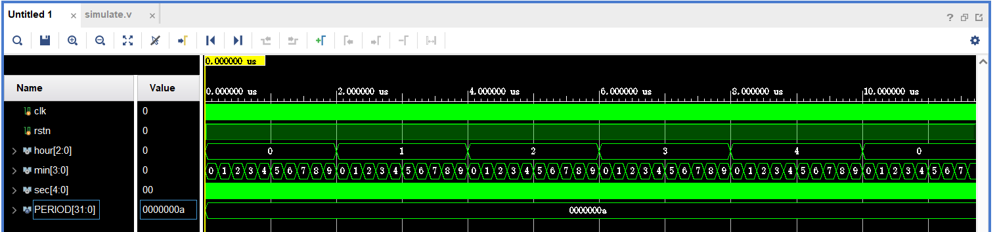
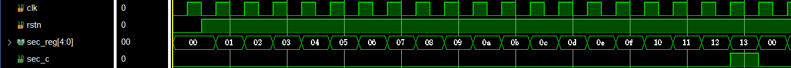
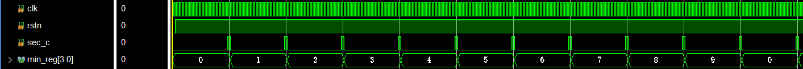
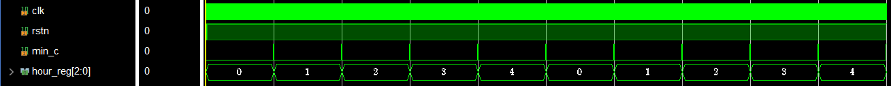
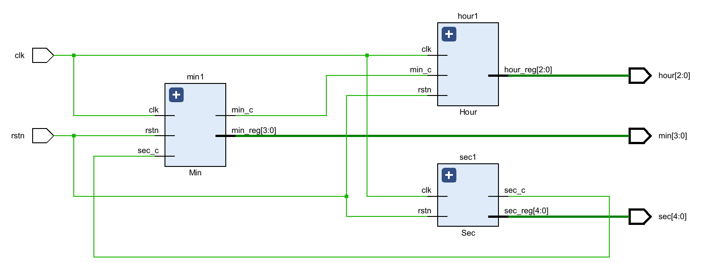

# COD Lab0

## 代码

```verilog
module Clock (
    input clk,
    input rstn, // asynchronous reset
    output [2:0] hour,
    output [3:0] min,
    output [4:0] sec
);  // you should not change code upon this line
    // your code here
    // you may need to add some extra signals
    wire sec_c, min_c;
    // think the ports needed and how to connect them
    Sec sec1(clk, rstn, sec, sec_c);
    Min min1(clk, rstn, sec_c, min, min_c);
    Hour hour1(clk, rstn, min_c, hour);
endmodule

// implement the three modules here
module Sec (
    input clk,
    input rstn,
    output reg [4:0] sec_reg,
    output reg sec_c
);
    always @(posedge clk or negedge rstn) begin
        if (!rstn)
            sec_reg <= 0;
        else if (sec_reg == 5'd19)
            sec_reg <= 0;
        else
            sec_reg <= sec_reg + 1;
    end
    always @(*) begin
        if (sec_reg == 5'd19)
            sec_c <= 1;
        else
            sec_c <= 0;
    end
endmodule

module Min (
    input clk,
    input rstn,
    input sec_c,
    output reg [3:0] min_reg,
    output reg min_c
);
    always @(posedge clk or negedge rstn) begin
        if (!rstn)
            min_reg <= 0;
        else if (sec_c) begin
            if (min_reg == 4'd9)
                min_reg <= 0;
            else
                min_reg <= min_reg + 1;
        end
        else
            min_reg <= min_reg;
    end
    always @(*) begin
        if (sec_c && min_reg == 4'd9)
            min_c <= 1;
        else
            min_c <= 0;
    end
endmodule

module Hour (
    input clk,
    input rstn,
    input min_c,
    output reg [2:0] hour_reg
);
    always @(posedge clk or negedge rstn) begin
        if (!rstn)
            hour_reg <= 0;
        else if (min_c) begin
            if (hour_reg == 3'd4)
                hour_reg <= 0;
            else
                hour_reg <= hour_reg + 1;
        end
        else
            hour_reg <= hour_reg;
    end
endmodule
```

## 仿真波形

### Clock



### Sec



### Min



### Hour



## 电路图



#### 实验反馈

文档写的很清晰，很详细，希望以后的实验文档能保持。
