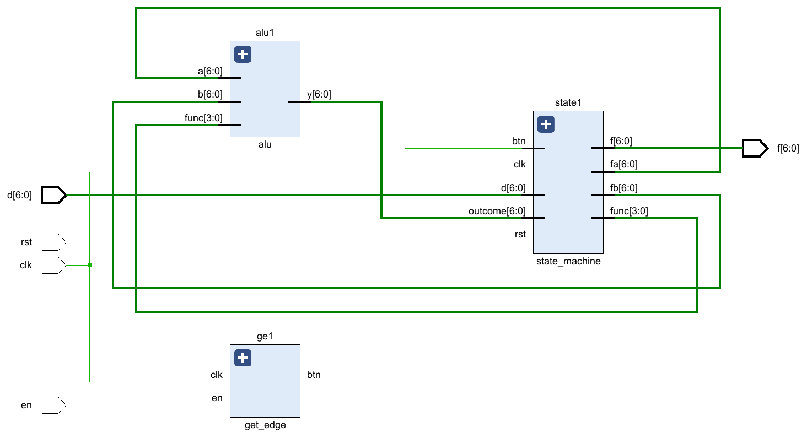

# Lab1 report

## 实验目的与内容

#### 实验目的

- 掌握算术逻辑单元 (ALU) 的功能
- 掌握数据通路和有限状态机的设计方法
- 掌握组合电路和时序电路，以及参数化、结构化的 Verilog 描述方法

#### 实验内容

**1. 算术逻辑单元（ALU）及测试：**

1. 设计两个操作数的 ALU 模块，实现包括加、减、大小比较、左移或右移等功能，并可进行溢出判断。
2. 设计 ALU 测试模块，可通过分时复用依次输入两操作数和操作类型，调用 ALU 模块进行计算并返回结果。

**2. ALU应用：计算斐波那契—卢卡斯数列（FLS）**

1. 设计 FLS 模块，调用 ALU 实现 FLS 数列的计算，可通过分时复用输入初始两项和操作模式，通过按钮得到数列的下一项。
2. 设计实现工作模式的动态改变，即在任意时刻都可以通过按钮和开关改变 FLS 的工作模式，继续按按钮即可得到新工作模式下的数列下一项。

## 逻辑设计

#### 底层模块的框图


### alu_test

#### 数据通路


#### 核心代码

##### alu 模块

```verilog
y = a + b; //加法
of = (a[WIDTH-1] == b[WIDTH-1]) && (a[WIDTH-1] != y[WIDTH-1]); //溢出判断

y = a - b; //减法
of = (a[WIDTH-1] != b[WIDTH-1]) && (a[WIDTH-1] != y[WIDTH-1]); //溢出判断

y = (a[WIDTH-1] == b[WIDTH-1]) ? (a < b) : a[WIDTH-1]; // 有符号小于
```

##### 取按钮边沿

```verilog
//取一周期的开关脉冲
reg temp1, temp2;
always @(posedge clk) temp1 <= en;
always @(posedge clk) temp2 <= temp1;
assign btn = temp1 & (~temp2);
endmodule
```

##### 分时复用

```verilog
always @(posedge clk) begin
    if (ena) begin
        a <= x;
        b <= 6'b0;
        func <= 4'b0;
    end
    else if (enb) begin
        a <= a;
        b <= x;
        func <= 4'b0;
    end
    else if (enf) begin
        a <= a;
        b <= b;
        func <= x[3:0];
    end
    else begin
        a <= a;
        b <= b;
        func <= func;
    end
end
```

### FLS

#### 数据通路


#### 状态机


#### 核心代码

##### 状态机

```verilog
// 状态定义
parameter LOADA = 2'h0, LOADB = 2'h1, LOADF = 2'h2, CALCU = 2'h3;
reg [1:0] current_state, next_state;

// current_state
always @(posedge clk or posedge rst) begin
    if (rst)
        current_state <= LOADA;
    else
        current_state <= next_state;
end

// next_state
always @(*) begin
    case (current_state)
        LOADA: begin
            if (btn)
                next_state <= LOADB;
            else
                next_state <= LOADA;
        end
        LOADB: begin
            if (btn)
                next_state <= LOADF;
            else
                next_state <= LOADB;
        end
        LOADF: begin
            if (btn)
                next_state <= CALCU;
            else
                next_state <= LOADF;
        end
        CALCU: begin
            if (btn)
                next_state <= CALCU;
            else
                next_state <= LOADF;
        end
        default: next_state <= LOADA;
    endcase
end

// output
always @(posedge clk or posedge rst) begin
    if (rst) begin
        func <= 4'b0;
        fa <= 7'b0;
        fb <= 7'b0;
        f <= 7'b0;
    end
    else begin
        case (next_state)
            LOADA: begin
                func <= 4'b0;
                fa <= d;
                fb <= 7'b0;
                f <= 7'b0;
            end
            LOADB: begin
                func <= 4'b0;
                fa <= fa;
                fb <= d;
                f <= fa;
            end
            LOADF: begin
                func <= d[3:0];
                fa <= fa;
                fb <= fb;
                f <= fb;
            end
            CALCU: begin
                func <= func;
                fa <= fb;
                fb <= outcome;
                f <= fb;
            end
            default: begin
                func <= 4'b0;
                fa <= 7'b0;
                fb <= 7'b0;
                f <= 7'b0;
            end
        endcase
    end
end
```

## 仿真结果与分析

### alu_tb

#### 波形图


#### 解释

加法运算，a = 010100(20), b = 011110(30), func = 0000；

运算结果为 y = 110010(-14)，of = 1，溢出。

### fls_tb

#### 波形图


#### 解释

初始两项为 f1 = 2, f2 = 3, 工作模式为加法，随着按钮依次输出后面的项 5， 8， 13；

更改工作模式为减法，随着按钮输出后面的项 -5， 18；

清零，开始新的工作。

## 电路设计与分析

### ALU


### FLS



> 因为原本生成的 RTL 电路太复杂，不方便截图展示，所以把状态机封装为一个模块，其实上面这张图与设计的数据通路是一致的

#### state_machine


## 测试结果与分析

不用写

## 总结

#### 收获

- 锻炼了 verilog 代码能力
- 熟悉了 vivado 的使用
- 复习了状态机的设计与三段式写法

#### 体验与建议

难度中等，无建议
