# lab2 report

## 实验目的与内容

#### 实验目的

- 掌握寄存器堆（Register File）功能、时序及其应用
- 掌握存储器的功能、时序
- 熟练掌握数据通路和控制器的设计和描述方法

#### 实验内容

##### 寄存器堆

- 设计 32 × WIDTH 寄存器堆（x0 恒为 0）
- 完成功能仿真

##### 存储器 ip 核

- 分别例化分布式和块式 16×8 位单端口 RAM
- 完成功能仿真，对比时序差异
- 比较块式 RAM 在不同操作模式下的时序差异
- 比较块式 RAM 输出寄存器不同设置下的时序差异 （**选做**）

##### FIFO 队列

- 设计实现依赖寄存器堆的 FIFO 队列模块，包括 LCU(控制模块)，RF(存储模块)，SDU(显示模块)
- 完成功能仿真
- 在 FPGAOL 中测试

添加功能：(**选做**)

- sw4 开启时，队头作为地址输入分布式存储器，输出对应数据；sw4 关闭时，恢复原来的功能(显示出队的数据)
- 将队头始终显示在最右端

## 逻辑设计

### 寄存器堆

##### 代码

```verilog
module register_file #(parameter WIDTH = 32) (
    input clk, //时钟（上升沿有效）
    input [4 : 0] ra0, //读端口0地址
    output[WIDTH - 1 : 0] rd0, //读端口0数据
    input[4: 0] ra1, //读端口1地址
    output[WIDTH - 1 : 0] rd1, //读端口1数据
    input[4 : 0] wa, //写端口地址
    input we, //写使能，高电平有效
    input[WIDTH - 1 : 0] wd //写端口数据
);
    //寄存器文件
    reg [WIDTH - 1 : 0] regfile[0 : 31];
    // x0寄存器始终为0
    initial regfile[0] = 0;
    //读端口
    assign rd0 = regfile[ra0];
    assign rd1 = regfile[ra1];
    //写端口
    always @ (posedge clk) begin
        if (we && wa) 
            regfile[wa] <= wd;
    end
endmodule
```

行为方式参数化；初始化 x0 为 0；禁止写入 x0；

### 存储器 ip 核

##### 代码

```verilog
// 例化
blk_mem_gen_0 blk (
  .clka(clk),    // input wire clka
  .wea(we),      // input wire [0 : 0] wea
  .addra(addr),  // input wire [3 : 0] addra
  .dina(din),    // input wire [7 : 0] dina
  .douta(dout_blk)  // output wire [7 : 0] douta
);
```

### FIFO

#### 框图

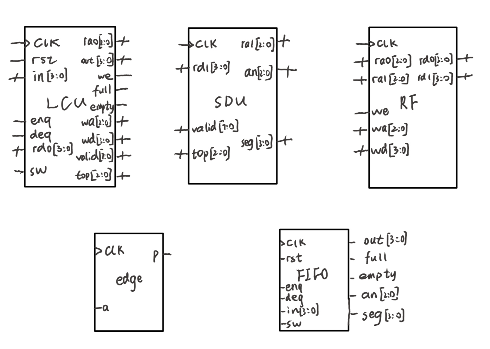

#### 数据通路

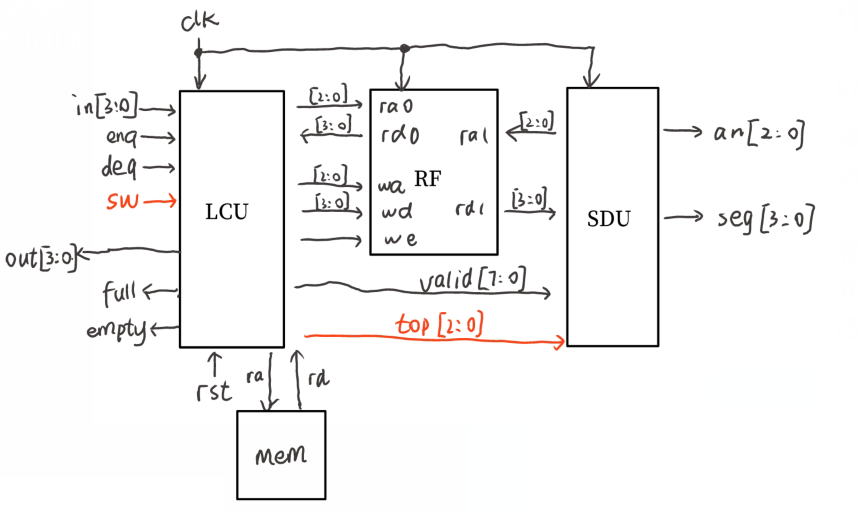

##### LCU 

控制出队入队操作。

入队时，接收 enq(入队使能)，in(入队数据)，输出 wa，wd，we，进入 RF 进行写操作；出队时，接收 deq，输出 ra0 到 RF，进行读操作，读出 rd0  后输出 out，同时输出 valid(数据有效标识) 到 SDU 改变显示；产生 full 和 empty 信号，标识队列的满或空。

##### RF

寄存器组，两个读端口，一个写端口。

##### SDU

显示控制模块。

接收 valid 数组，用于判断某个数据是否显示；输出 ra1 到 RF 进行读操作，读出 rd1 后输出到七段数码管 seg；接收队头位置 top，用于计算显示偏移量，使队头始终在最右端。

#### 状态机

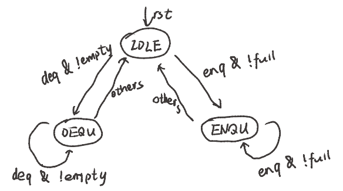

#### 代码

##### LCU

```verilog
// full & empty
assign full = (wp == rp & valid[wp]);
assign empty = ~valid[rp];
// 出/入队使能信号处理
wire enq0, deq0;
sign_edge se0(clk, enq, enq0);
sign_edge se1(clk, deq, deq0);
// out
wire [3:0] rd1;
reg flg = 0;    // 用于标记出队操作,去除不必要的输出
// 例化存储器
dist_mem_gen_0 mem0 (.a(rd0), .d(0), .clk(clk), .we(0), .spo(rd1));
always @(*) begin
    if (sw)
        out = rd1; 	// 显示存储器数据
    else if (flg & ~valid[ra0])	
        out = rd0;	// 显示寄存器数据
    else out = 0;
end
// current_state
always @(posedge clk or posedge rst) begin
    if (rst)
        current_state <= IDLE;
    else
        current_state <= next_state;
end
// next_state
always @(*) begin
    if (enq0 & !full)
        next_state = ENQU;
    else if (deq0 & !empty)
        next_state = DEQU;
    else
        next_state = IDLE;
end
// output
always @(posedge clk or posedge rst) begin
    if (rst) begin
        ra0 <= 0; we <= 0; wa <= 0; wd <= 0;
        valid <= 0; wp <= 0; rp <= 0; flg <= 0;
    end
    else begin
        case (current_state)
            IDLE: begin
                we <= 0;
                if (sw)
                    ra0 <= rp; // 如果sw4开启，需要把ra0移到队头
                else
                    ra0 <= rp - 1; // 如果sw4关闭，需要回到原来的位置
            end
            ENQU: begin
                we <= 1;
                wa <= wp;
                wd <= in;
                valid[wp] <= 1;
                wp <= wp + 1;
            end
            DEQU: begin
                flg <= 1;
                ra0 <= rp;
                valid[rp] <= 0;
                rp <= rp + 1;
            end
            default: ;
        endcase
    end
end
```

- 判断队空和队满：头指针等于尾指针且此处数据有效时队满，头指针所指数据无效时队空
- 出入队使能信号处理：两级同步加取边沿
- 输出：sw4 关闭时，ra0 指向上一次出队的元素地址，输出 rd0；sw4 开启时，ra0 指向队头，读出 rd0 后将其作为地址传入存储器，输出得到的 rd1
- 状态机：三段式，三个状态。IDLE 为待机状态，清零写使能，控制输出的切换(sw4开启与否)；ENQU 为入队状态，写使能置 1，在 wp 位置写入数据，设置此地址数据有效(valid)，wp 自增；DEQU 为出队状态，输出出队数据，设置此地址数据无效，rp 自增

##### RF

```verilog
// 寄存器堆
reg [3:0] regfile[0:7];
initial regfile[0] = 0;
// 读
assign rd0 = regfile[ra0];
assign rd1 = regfile[ra1];
// 写
always @(posedge clk) begin
    if (we && wa) begin
        regfile[wa] <= wd;
    end
end
```

很简单，分析略

##### SDU

```verilog
// 分时复用
reg [9:0] count = 0;
assign ra1 = an + top;
always @(posedge clk) begin
    count <= count + 1;
    if (valid[count[9:7] + top]) begin
        an <= count[9:7];
        seg <= rd1;
    end
    else if (valid[top]) begin
        an <= 0;
        seg <= rd1;
    end
    else begin
        an <= 0;
        seg <= 0;
    end
end
```

- 通过 count 计数得到新时钟频率，切换数码管选择信号 an 和对应数据 seg。
- 通过队头位置 top 就可以计算显示的位移差，实现 an == 0 时，即第一个数码管始终显示队头元素
- 如果此数码管要显示的数据有效，则显示；否则回到第一个数码管，显示队头元素，如果是空队，显示 0

## 仿真结果与分析

### 寄存器堆

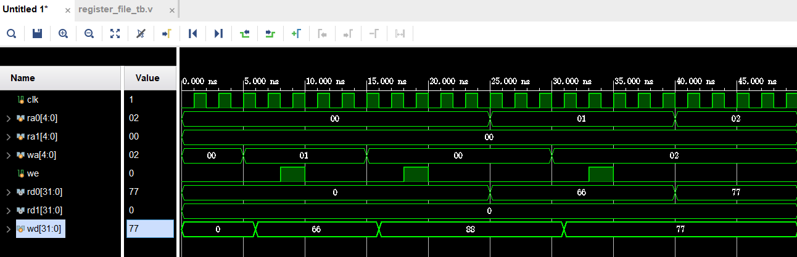

向 x1 写入 66，写入成功；向 x0 写入 88，写入失败；

通过 ra0 读取 x1，rd0 输出 66，读取成功；通过 ra1 读取 x0，rd1 输出 0；

### 存储器 ip 核

##### 分布式与块式对比

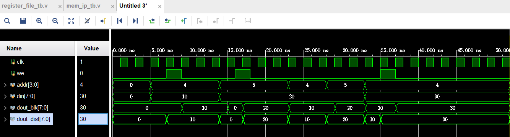

分布式的 RAM 读操作是**异步**的，即读即得，不必等待时钟上升沿，若对应地址的数据发生了改变，那么输出也直接更新；

块式的 RAM 读操作是**同步**的，若在非上升沿读取某地址，那么输出会在下一个时钟上升沿得到，若对应地址的数据被写入覆盖掉了，那么输出会在下一个时钟上升沿更新。

##### 不同操作模式对比

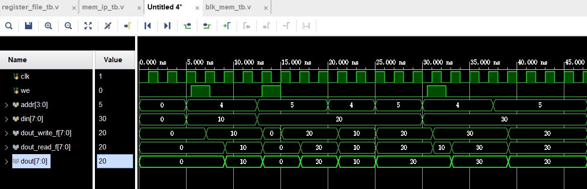

写优先：在写入的那个时钟上升沿**同时更新**输出

读优先：在写入时，输出是**此地址原来的数据值**，写入后进行读操作时再更新输出

nochange：写操作时，输出**保持原值不变**(不一定是此地址的原值)，写入后进行读操作时再更新输出

##### 不同输出寄存器设置对比

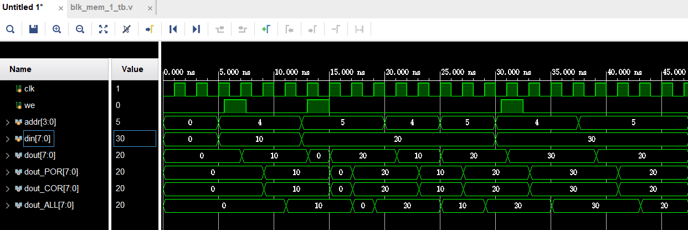

开启 POR 和开启 COR 相比都不开启时分别输出慢一个周期，两个都开启时慢两个周期。

### FIFO 队列

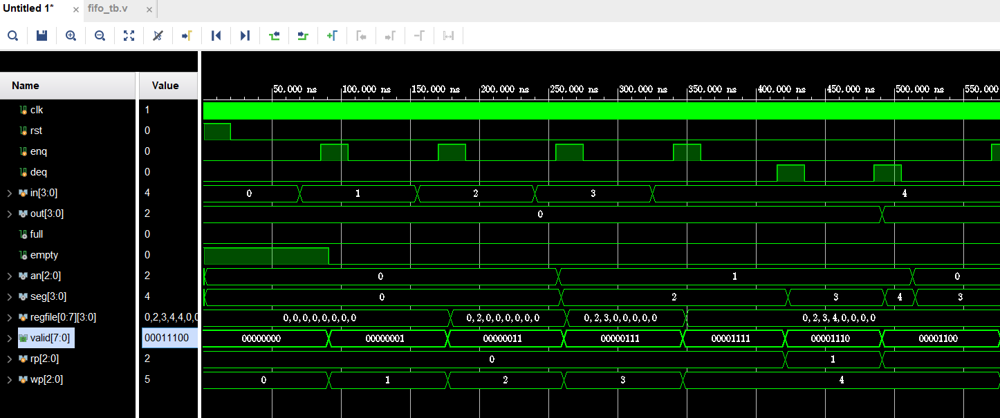

1 入队，入队失败(x0 恒为 0)，2 入队，3入队，4入队，1出队，2出队

## 电路设计与分析

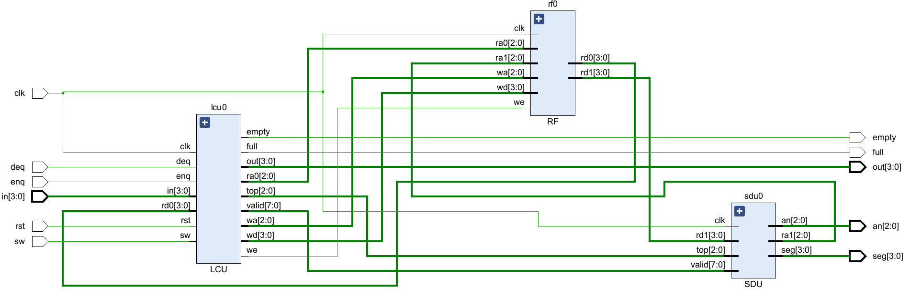

RTL 生成电路如上，与设计的数据通路一致。

细化模块的生成电路如下：

RF：

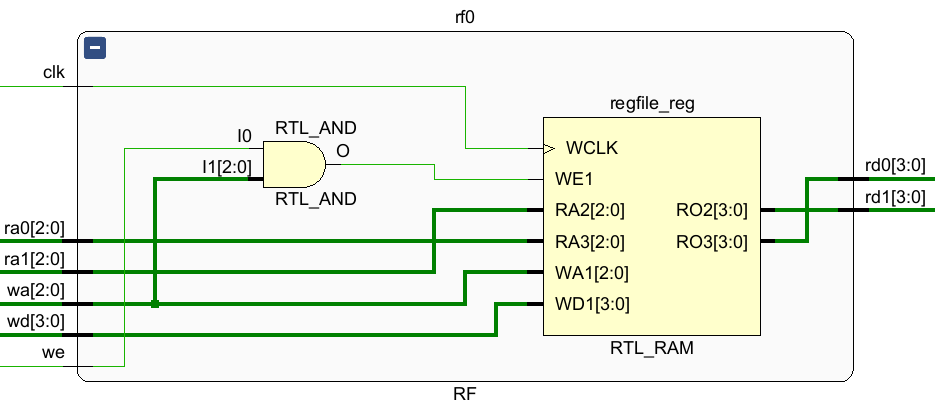

SDU：

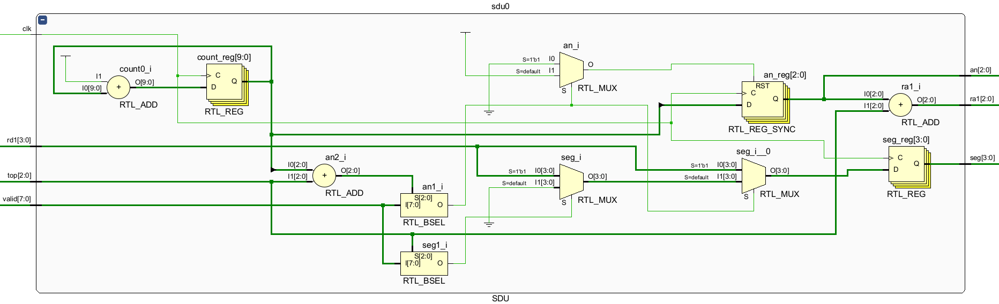

LCU：

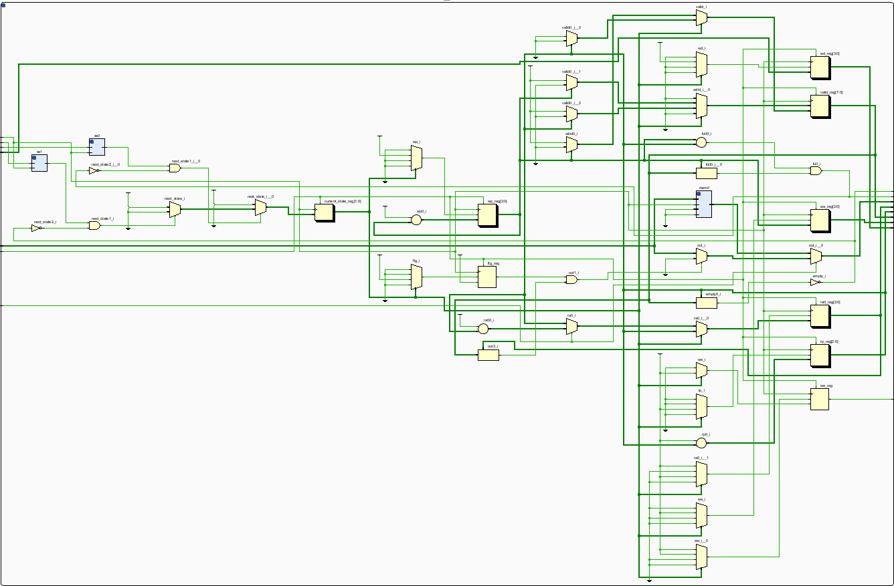

## 总结

#### 收获

- 锻炼了 verilog 代码能⼒ 
- 熟悉了 vivado 的使⽤ 
- 复习了状态机的设计与三段式写法

#### 体验和建议

难度中等，无建议
