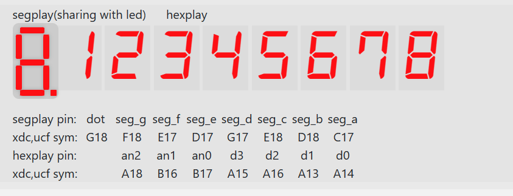
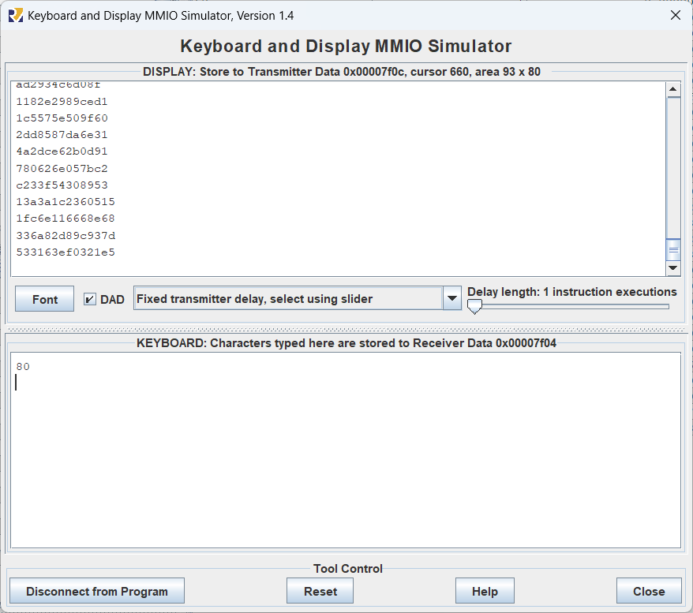

# lab3 report

## 实验内容

### PDU

- 补充完整 `Shift_reg.v` 文件
- 熟悉 PDU 的上板使用

### FLS

- 使用 rars 软件完成 risc-v 汇编程序的编写与测试
- 使用 rars 软件生成 coe 文件
- 用给定的十条指令完成 fls 数列的简单计算
- 在 fls 的基础上实现外设输入输出 (**选做**)
- 在 fls 的基础上实现大整数运算与存储 (**选做**)

## 核心代码

### Shift_reg

```verilog
always @(posedge clk or posedge rst) begin
    if (rst)
        dout <= 0;
    else if (set)
        dout <= din;
    else if (add) begin
        dout <= ((dout << 4) | hex);
    end
    else if (del) begin
        dout <= (dout >> 4);
    end
end
```

复位：

rst 为高电平时异步复位；

置数：

set 信号为高电平时为寄存器赋值；

左移（入栈）：

add 信号为高电平时寄存器值左移 4 位，再逻辑或上 hex（也可以加上 hex），将空出来的低位设为 hex[3:0]。

右移（出栈）：

del 信号为高电平时寄存器右移 4 位，空出的高位自动补 0

### fls 必做

```assembly
# 设置前两项
.data
1 # a1 in 0x0000
1 # a2 in 0x0004
.text
# 输入
addi t0 x0 20 # Store n=20 in reg t0
addi t1, x0, 8 # t1做存储指针
# 计算
lw t2, 0  # f(n-2)
lw t3, 4  # f(n-1)
addi t0, t0, -2
loop: add t4, t2, t3 # f(n)
addi t2, t3, 0
addi t3, t4, 0
# 存储
sw t4, 0(t1) # save f(n)
addi t1, t1, 4 # 指向下个储存位置
addi t0, t0, -1 # n--
blt x0, t0, loop
done: #结束程序
```

t0： 

存储 n，表示要计算的项数，每得到一项就要减 1，初始先减 2(前两项不用计算)。

t1：

指针，用于存储计算得到的值，每存储一项就要加 4，到下一个目标地址

t2：

存储递推式中的 f(n-2)，每计算一次就更新为当时的 f(n-1)

t3：

存储递推式中的 f(n-1)，每计算一次就更新为当时的 f(n)

t4：

存储 f(n)，计算 f(n) = f(n-1) + f(n-2)，计算后存储到 t1 相应地址

### fls 选做

#### 外设输入输出

##### 与键盘和显示器交互

```assembly
# 读入函数
scan:
loop: lw a1, 0x7f00
beq a1, x0, loop
lb a0, 0x7f04
jalr x0, 0(x1)
# 输出函数(数字转ascii码)
print:
loop1: lw a1, 0x7f08
beq a1, x0, loop1
addi a1, a0, -10
addi a0, a0, 48
blt a1, x0, digit
addi a0, a0, 39
digit: sb a0, 0(t6)
jalr x0, 0(x1)
```

**输入：**

设计读入函数，直接将输入的 ascii 码值读入 a0，a0 作为函数返回值。

轮询输入状态寄存器 0x7f00，当值为 1 时读取输入寄存器 0x7f04，将得到的 ascii 码赋给寄存器 a0

**输出：**

设计输出函数，将要输出的 4bit 内容(a0)编码为对应的 ascii 码后输出，a0 做函数参数。

首先判断 a0 是否大于等于 10，如果小于 10，直接加 48 即可转为 ascii 码；如果大于 10，需要再加 39 才能转为对应的 ascii 码（10 转为 a(97)）。

轮询输出状态寄存器 0x7f08，当值为 1 时将转换后的 a0 输出到输出寄存器 0x7f0c

##### 读入解析和拆分输出

```assembly
# 输入
addi t5, x0, 10
li t6, 0x7f0c
li s7, 0x80000000
jal scan
addi t1, a0, -48
jal scan
addi t2, a0, 0
beq t2, t5, entry1
addi t2, t2, -48
addi t3, x0, 9	# 循环控制
loop2: add t0, t0, t1
addi t3, t3, -1
bge t3, x0, loop2
add t0, t0, t2
jal scan
addi t3, a0, 0
beq t3, t5, entry
entry1: addi t0, t1, 0
entry: addi t1, x0, 16 # t1做存储指针
# 打印
addi s8, x0, 0
addi s0, x0, 0 # 左移位数
addi s1, x0, 28 # 右移位数
loop4: sll a0, s5, s0
srl a0, a0, s1
jal setflg
beq s8, x0, skip # 去除前导0
jal print
skip: addi s0, s0, 4
bge s1, s0, loop4
addi s0, x0, 0
addi s8, x0, 0
loop5: sll a0, s4, s0
srl a0, a0, s1
bne s5, x0, skip1
jal setflg
beq s8, x0, skip2 # 去除前导0
skip1: jal print
skip2: addi s0, s0, 4
bge s1, s0, loop5
addi a0, x0, -38
jal print
```

**读入解析**

因为 n 是 3 到 80，所以可能读入一位数或者先后读入两位数的十位和个位，设计中以换行符“\\n”代表输入的结束，所以三次读取即可完成解析。

第一次读取一位数，存储在 t1 中；第二次读取，如果是换行符，则 t0 = t1，进入计算阶段，如果是数字，则存储在 t2 中，令 t0 = t1 \* 10 + t2（乘法可以通过循环加实现）；第三次读取，直到读取到换行符，进入计算阶段。

**拆分输出**

计算得到的数列项以 32 位二进制形式存储在寄存器中，需要拆分为 8 个 4bit 的数据段，以 16 进制形式输出到显示器，拆分通过移位实现。

要得到第一个 4bit，直接右移 28bit 即可；要得到第二个 4bit，需要先左移 4 bit，清零前面的无效位，再右移 28bit；以此类推，可以通过循环实现。

拆分后的数据通过 print 函数依次输出到显示器

#### 去除前导 0

```assembly
# 标识函数(去除前导0)
setflg:
bne s8, x0, return
beq a0, x0, return
addi s8, x0, 1
return: jalr x0, 0(x1)
```

设计标识 s8，当 s8 = 0 时，直接忽略要输出的 0；当 s8 = 1 时，不能忽略。每输出完一个数列项，就要把 s8 重新置 0；每当要输出 4bit 数据时，就要调用 setflg 函数，维护 s8 的值。

设计标识函数 setflg，如果 s8 = 1，直接返回（已经到达有效部分）；如果 s8 = 0，判断当前要输出的数据是否为 0，若不为 0（第一个有效数据），则将 s8 置 1。

#### 大整数计算与存储

```assembly
# 计算
lw t3, 0
lw t2, 4  # f(n-2)
addi a0, t2, 0
jal print
addi a0, x0, -38
jal print
lw s3, 8
lw s2, 12 # f(n-1)
addi a0, s2, 0
jal print
addi a0, x0, -38
jal print
addi t0, t0, -2
loop3: add s4, t2, s2 
add s5, t3, s3 # f(n)=f(n-1)+f(n-2)
and s6, t2, s7
beq s6, x0, noc1
and s6, s2, s7
beq s6, x0, noc2
carry: addi s5, s5, 1
jal next
noc1: and s6, s2, s7
beq s6, x0, next
noc2: and s6, s4, s7
beq s6, x0, carry
next: addi t2, s2, 0
addi t3, s3, 0
addi s2, s4, 0
addi s3, s5, 0
```

用两个 32bit 寄存器存储一个 64bit 的数据，进行加法时两部分对应相加，然后判断是否低位寄存器相加是否溢出，如果溢出，需要进位到结果的高位寄存器中。

看最高位的符号即可进行溢出判断，1 + 1 = 0, 1 + 1 = 1, 0 + 1 = 0，1 + 0 = 0，四种溢出的情况。

大整数的存储把高位和低位分别存储即可。

> 如果考虑到 risc-v 的小端存储特性，需要先存低位，再存高位，这里我为了方便调试先存的高位

## 运行结果





## 总结

#### 收获

- 锻炼了 risc-v 汇编代码能⼒ 
- 熟悉了 rars 的使⽤

#### 体验和建议

难度适中，无建议。
