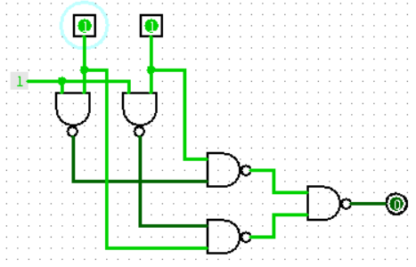
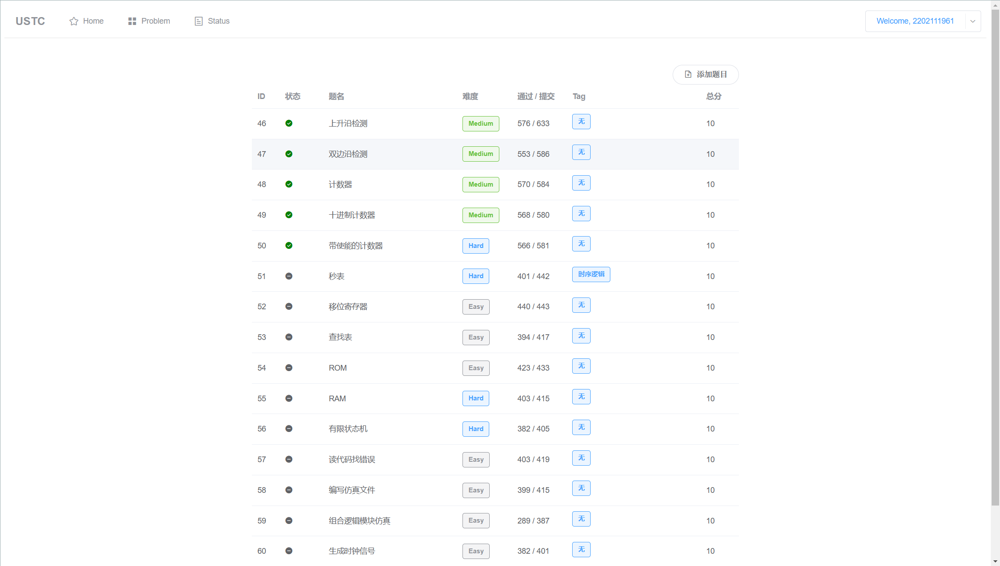

## 第一周作业

### T1

对于变量 A,B 列出真值表如下：

| A    | B    | $\overline{A+B}$ | $\overline{A}\cdot\overline{B}$ | $\overline{A\cdot B}$ | $\overline{A}+\overline{B}$ |
| ---- | ---- | ---------------- | ------------------------------- | --------------------- | --------------------------- |
| 0    | 0    | 1                | 1                               | 1                     | 1                           |
| 0    | 1    | 0                | 0                               | 1                     | 1                           |
| 1    | 0    | 0                | 0                               | 1                     | 1                           |
| 1    | 1    | 0                | 0                               | 0                     | 0                           |

由表易证。


由摩根律，有
$$
\begin{align}
A\oplus B&=A\overline{B}+\overline{A}B\\
&=\overline{(\overline{A}+B)(A+\overline{B})}\\
&=\overline{\overline{A\overline{B}}\ \overline{\overline{A}B}}\\
\end{align}
$$
其中非门可以用与 1 取与非实现。如下图



### T2

都转化为十进制如下：

$(101001)_2=1+8+32=41$

$(52)_8=2+40=42$

$(00101001)_{BCD}=29$

$(33)_{16}=3+48=51$

所以从小到大排列如下：
$$
(00101001)_{BCD}< (101001)_2< (52)_8< (33)_{16}
$$

### T3

##### (1)

`ALU`：计算器，执行算术和逻辑运算

`REG FILE`：寄存器组，暂存数据

`MUX`：数据选择器，用于信号的切换

`MEMORY`：内存，存放数据或程序

##### (2)

CPU 包含除 `MEMORY` 之外的其他三个结构

内存即为 `MEMORY`

##### (3)

输入设备：键盘，鼠标

输出设备：显示器，音响

### T4

代码如下：

```verilog
module Reg(
	input clk,
	input reset,
	input [7:0] d,
	output reg [7:0] q
);
always @(negedge clk) begin
    if (reset)
        q <= 8'h12;
    else
        q <= d;
end
endmodule
```

若改为异步复位，则需要改为 `always@(negedge clk or posedge reset)`

#### 实验题1



#### 思考题1

思考了，没思考出来😢
