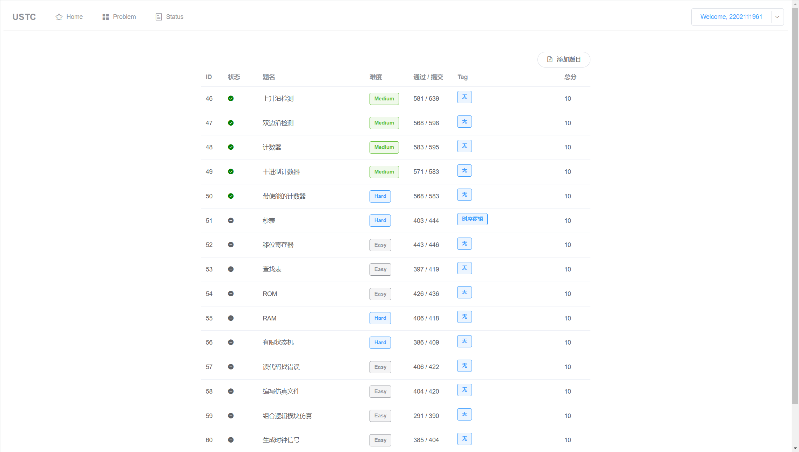

# 计算机组成原理

## 第二次作业

### T1

##### (1)

$$
w1=\frac{84-\pi(\frac{15}{2})^2\times0.020}{84}=95.79\%\\
w2=\frac{100-\pi(\frac{20}{2})^2\times0.031}{100}=90.26\%
$$

所以 A 的工艺良率为 95.79%，B 的工艺良率为 90.26%

> 错了！工艺良率有公式：
> $$
> 工艺良率=\frac{1}{(1+(单位面积缺陷数\times晶片面积/2))^2}
> $$

##### (2)

$$
m1=\frac{12}{84\times0.9579}=0.15¥\\
m1=\frac{15}{100\times0.9026}=0.17¥\\
$$

所以 A 的单位价格为 0.15 元，B 的单位价格为 0.17 元

### T2

##### (1)

$$
w1=\frac{\frac{0.7}{1+0.25}+0.21+0.09}{1}=86\%
$$

降低为原来的 86%

##### (2)

设提升 x（x > 0）
$$
w2=\frac{0.7+\frac{0.21}{1+x}+0.09}{1}=86\%\Rightarrow x=2
$$

需要提升 200%

##### (3)

$$
w2=\frac{0.7+0.21+\frac{0.09}{1+x}}{1}=86\%\Rightarrow 无解
$$

所以不可能

### T3

##### (1)

基准程序 P 的运行时间分别为：
$$
t1=\frac{2\times5\times10^9}{5\times10^9}=2s\\
t2=\frac{1.8\times3.3\times10^9}{3\times10^9}=1.98s\\
$$
有 t1 > t2

所以 “时钟频率越高，性能越好”是错误的

##### (2)

$$
MIPS(1)=\frac{5\times 10^3}{t1}=2500\\
MIPS(2)=\frac{3.3\times 10^3}{t2}=1667\\
$$

有 MIPS(1) > MIPS(2)

所以 “MIPS 越高，性能越好”是错误的

##### (3)

CPU 的指令架构不同，不同的 CPU 可能使用不同的指令集，导致实现相同功能需要的指令数目不同

### T4

D

> P 为 10^15^，所以为 93.0146 千万亿次，即 9.3 亿亿次

### T5

