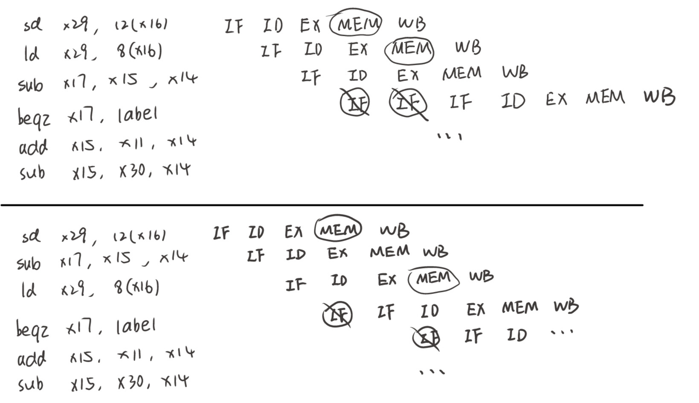

# COD

## HW6

### T1

##### (1)

非流水线：T = 250 + 350 + 150 + 300 + 200 = 1250ps

流水线：T = max{250, 350, 150, 300, 200} = 350ps

##### (2)

`ld x1, 0(x2)`

流水线：1750ps

非流水线：1250ps

##### (3)

拆分 ID，新处理器时钟周期为 T = max{250, 175, 150, 300, 200} = 300ps

##### (4)

load 和 store 要利用数据存储器

20% + 15% = 35%

##### (5)

ALU/Logic 和 Load 要利用寄存器堆写端口

45% + 20% = 65%

### T2

##### (1)

如下图：

运行到 beqz 指令时停顿，因为 IF 段与 sd 的 MEM 段同时访问存储器，又因为停顿一次后 IF 又与 ld 的 MEM 段同时访问存储器，所以会再停顿一次。

##### (2)

不能，如上图，重排后依然需要停顿两次。

##### (3)

必须用硬件解决；

不能，因为 NOP 指令也需要 IF，访问存储器

##### (4)

每个 ld 或 sd 指令的 MEM 段总会与后面某指令的 IF 段重合。

25% + 11% = 36%

### T3

##### (1)

不会，因为最耗时的 ID 段延迟不变

##### (2)

可能，MEM 和 EX 阶段重叠可以减少⼀段时钟周期。

##### (3)

可能，因为可能会造成总指令数的增加（ld 等指令可能会需要 addi 的协助）

### T4

##### (1)

如下图，停顿两次

##### (2)

如上图，从未出现。

